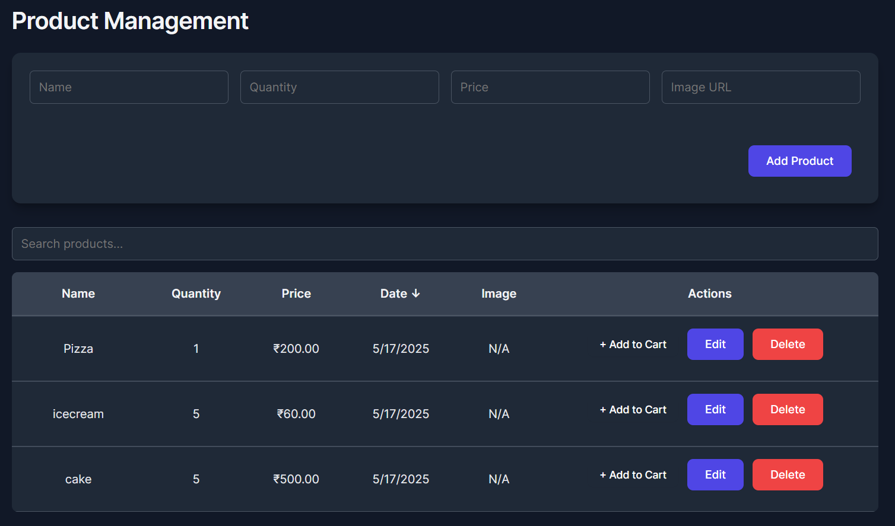
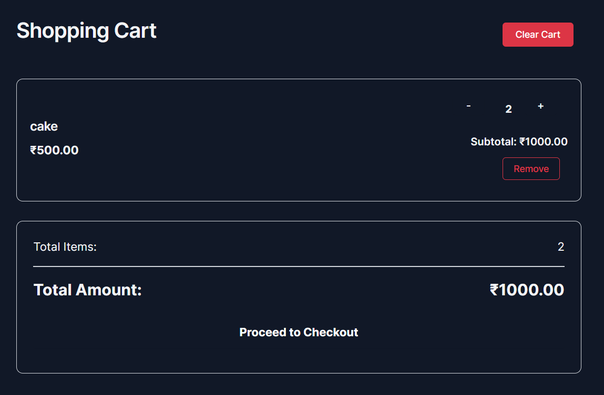
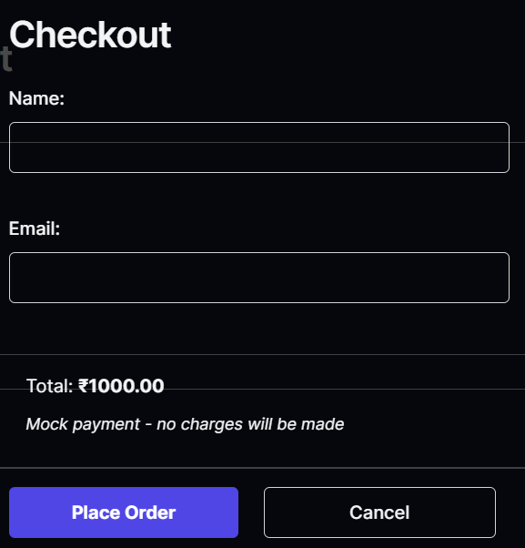
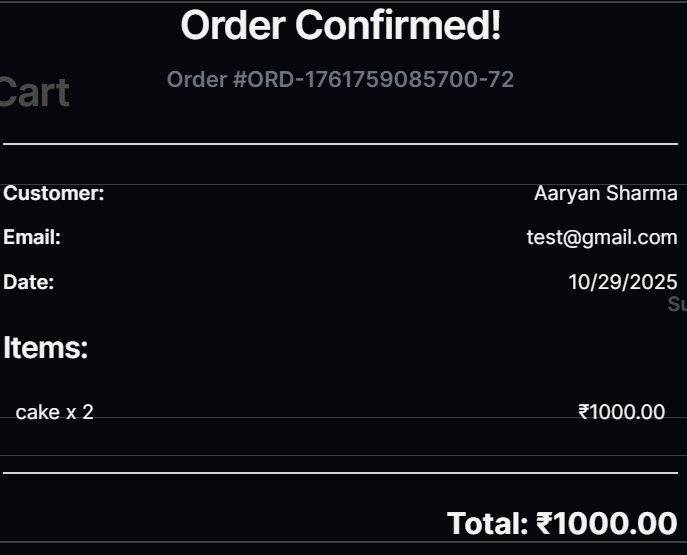

# E-Commerce Shopping Cart Application


A full-featured e-commerce shopping cart application built with the MERN stack (MongoDB, Express.js, React, Node.js) featuring product management, shopping cart functionality, checkout process, and order management.

## ✨ Features

### Product Management
- **Complete CRUD Operations** - Create, Read, Update, and Delete Products
- **Real-time Data Management** - Instantly see changes in the product list
- **Sorting & Filtering** - Sort by name, price, quantity, or date
- **Search Functionality** - Find products quickly with the search bar
- **Pagination** - Navigate through products easily (10 items per page)
- **Form Validation** - Ensures data integrity (price and quantity > 0)

### Shopping Cart
- **Add to Cart** - Add products directly from the product list
- **Cart Badge** - Real-time cart item count in navigation
- **Quantity Controls** - Increase/decrease item quantities
- **Remove Items** - Remove individual items or clear entire cart
- **Cart Persistence** - Cart data stored in MongoDB
- **Subtotal Calculation** - Automatic price calculations

### Checkout & Orders
- **Checkout Form** - Customer name and email validation
- **Mock Payment** - Simulated payment processing
- **Order Confirmation** - Receipt modal with order details
- **Order Number Generation** - Unique order identifiers
- **Order Persistence** - All orders saved to database
- **Email Notifications** - Order confirmation with customer details

### UI/UX
- **Responsive Design** - Works on desktop, tablet, and mobile devices
- **Navigation** - Switch between Products and Cart views
- **Alert Notifications** - Real-time feedback on all operations
- **Empty States** - Helpful messages when cart is empty
- **Modal Dialogs** - Checkout and receipt modals
- **Currency Display** - All prices in Indian Rupees (₹)

## 🚀 Tech Stack

<table>
  <tr>
    <th>Category</th>
    <th>Technologies</th>
  </tr>
  <tr>
    <td><strong>Frontend</strong></td>
    <td>
      React 19, Vite 6, Axios, CSS3
    </td>
  </tr>
  <tr>
    <td><strong>Backend</strong></td>
    <td>
      Node.js, Express.js, Mongoose, CORS
    </td>
  </tr>
  <tr>
    <td><strong>Database</strong></td>
    <td>
      MongoDB Atlas
    </td>
  </tr>
  <tr>
    <td><strong>Deployment</strong></td>
    <td>
      Vercel (Frontend & Backend)
    </td>
  </tr>
</table>

## 📊 Database Schemas

### Product Schema
   ```javascript
   {
     name: {
       type: String,
       required: true
     },
     quantity: {
       type: Number,
       required: true
     },
     price: {
       type: Number,
       required: true
     },
     imageUrl: {
       type: String,
       required: false
     }
   },
   {
     timestamps: true
   }
   ```

### Cart Item Schema
   ```javascript
   {
     productId: {
       type: mongoose.Schema.Types.ObjectId,
       ref: 'Product',
       required: true
     },
     name: String,
     price: Number,
     quantity: {
       type: Number,
       required: true,
       min: 1
     },
     imageUrl: String
   },
   {
     timestamps: true
   }
   ```

### Order Schema
   ```javascript
   {
     items: [{
       productId: ObjectId,
       name: String,
       price: Number,
       quantity: Number,
       imageUrl: String
     }],
     customerName: {
       type: String,
       required: true
     },
     customerEmail: {
       type: String,
       required: true
     },
     totalAmount: {
       type: Number,
       required: true
     },
     orderNumber: {
       type: String,
       required: true,
       unique: true
     }
   },
   {
     timestamps: true
   }
   ```

## 🔌 API Endpoints

### Products
- `GET /api/products` - Get all products
- `GET /api/products/:id` - Get single product
- `POST /api/products` - Create new product
- `PUT /api/products/:id` - Update product
- `DELETE /api/products/:id` - Delete product

### Cart
- `GET /api/cart` - Get all cart items
- `POST /api/cart` - Add item to cart
- `PUT /api/cart/:id` - Update cart item quantity
- `DELETE /api/cart/:id` - Remove item from cart
- `DELETE /api/cart` - Clear entire cart
- `POST /api/cart/checkout` - Process checkout and create order

## 🛠️ Local Development

### Prerequisites
- Node.js (v16 or higher)
- MongoDB Atlas account
- npm or yarn

### Backend Setup

1. Clone the repository:
   ```bash
   git clone https://github.com/Aaryan-Sharma-5/crud-app.git
   cd crud-app/backend
   ```

2. Install dependencies:
   ```bash
   npm install
   ```

3. Create `.env` file:
   ```bash
   MONGODB_URI=your_mongodb_connection_string
   PORT=3000
   ```

4. Start the backend server:
   ```bash
   npm start
   ```

### Frontend Setup

1. Navigate to frontend directory:
   ```bash
   cd ../frontend
   ```

2. Install dependencies:
   ```bash
   npm install
   ```

3. Create `.env.development` file:
   ```bash
   VITE_API_URL=http://localhost:3000
   ```

4. Start the development server:
   ```bash
   npm run dev
   ```

5. Open your browser to `http://localhost:5173`

## 🌐 Deployment

### Backend Deployment (Vercel)

1. Create `vercel.json` in the backend directory:
   ```json
   {
     "version": 2,
     "builds": [
       {
         "src": "index.js",
         "use": "@vercel/node"
       }
     ],
     "routes": [
       {
         "src": "/(.*)",
         "dest": "/index.js"
       }
     ]
   }
   ```

2. Add environment variables in Vercel dashboard:
   ```bash
   MONGODB_URI=your_mongodb_connection_string
   ```

3. Deploy:
   ```bash
   cd backend
   vercel --prod
   ```

### Frontend Deployment (Vercel)

1. Create `vercel.json` in the frontend directory:
   ```json
   {
     "buildCommand": "npm run build",
     "outputDirectory": "dist",
     "framework": "vite",
     "installCommand": "npm install"
   }
   ```

2. Create `.env.production` file:
   ```bash
   VITE_API_URL=https://your-backend-url.vercel.app
   ```

3. Deploy:
   ```bash
   cd frontend
   vercel --prod
   ```

## 📸 Screenshots

### Product Management


### Shopping Cart


### Checkout Process


### Order Receipt


## 🎯 Future Enhancements

- [ ] User authentication and registration
- [ ] User-specific carts (multi-user support)
- [ ] Product categories and filtering
- [ ] Product reviews and ratings
- [ ] Wishlist functionality
- [ ] Order history for users
- [ ] Payment gateway integration
- [ ] Admin dashboard
- [ ] Inventory management
- [ ] Email notifications
- [ ] Product search with autocomplete

## 📝 License

This project is open source and available under the [MIT License](LICENSE).

## 🤝 Contributing

Contributions, issues, and feature requests are welcome! Feel free to check the [issues page](https://github.com/Aaryan-Sharma-5/crud-app/issues).

---

<p align="center">Made with ❤️ by <a href="https://github.com/Aaryan-Sharma-5">Aaryan</a></p>
