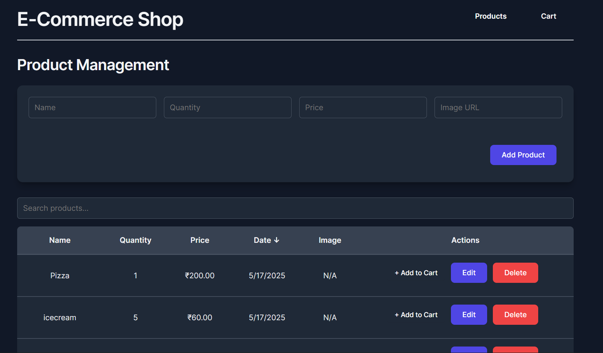

# MERN CRUD APP



A clean, responsive Product management application built with the MERN stack (MongoDB, Express.js, React, Node.js) featuring complete CRUD operations, sorting, searching and pagination

## ✨ Features

- **Complete CRUD Operations** - Create, Read, Update, and Delete Products
- **Real-time Data Management** - Instantly see changes in the Product list
- **Responsive Design** - Works on desktop and mobile devices
- **Sorting & Filtering** - Sort by name, price, quantity or date
- **Search Functionality** - Find Products quickly with the search bar
- **Pagination** - Navigate through Products easily with paginated results
- **Form Validation** - Ensures data integrity
- **Alert Notifications** - Provides feedback on all operations

## 🚀 Tech Stack

<table>
  <tr>
    <th>Category</th>
    <th>Technologies</th>
  </tr>
  <tr>
    <td><strong>Frontend</strong></td>
    <td>
      React, Vite, CSS
    </td>
  </tr>
  <tr>
    <td><strong>Backend</strong></td>
    <td>
      Node.js, Express.js, Mongoose
    </td>
  </tr>
  <tr>
    <td><strong>Database</strong></td>
    <td>
      MongoDB Atlas
    </td>
  </tr>
  <tr>
    <td><strong>Deployment</strong></td>
    <td>
      Vercel (Frontend & Backend)
    </td>
  </tr>
</table>

## Product Schema

   ```javascript
   {
     name: {
       type: String,
       required: true
     },
     quantity: {
       type: Number,
       required: true,
     },
     price: {
       type: Number,
       required: true,
     },
     imageUrl: {
       type: String,
       required: false
     }
   },
   {
     timestamps: true
   }
   ```

## 🌐 Deployment

### Backend Deployment (Vercel)

1. Create `vercel.json` file in the backend directory:
   ```javascript
   {
    "version": 2,
    "builds": [
      {
        "src": "index.js",
        "use": "@vercel/node"
      }
    ],
    "routes": [
      {
        "src": "/(.*)",
        "dest": "/index.js",
        "headers": {
          "Access-Control-Allow-Origin": "*",
          "Access-Control-Allow-Methods": "GET, POST, PUT, DELETE, OPTIONS",
          "Access-Control-Allow-Headers": "Content-Type, Authorization, X-Requested-With"
        }
      }
    ]
   }
   ```

2. Add the environment variables:
   ```bash
   MONGODB_URI=your_mongodb_connection_string
   FRONTEND_URL=https://your-frontend-url.vercel.app
   ```

3. Deploy to Vercel:
   ```bash
   vercel --prod
   ```

### Frontend Deployment (Vercel)

1. Add the environment variables:
   ```bash
   VITE_API_URL=https://your-backend-url.vercel.app/api/Products
   ```

2. Deploy to Vercel:
   ```bash
   vercel --prod
   ```

---

<p align="center">Made with ❤️ by <a href="https://github.com/Aaryan-Sharma-5">Aaryan</a></p>
